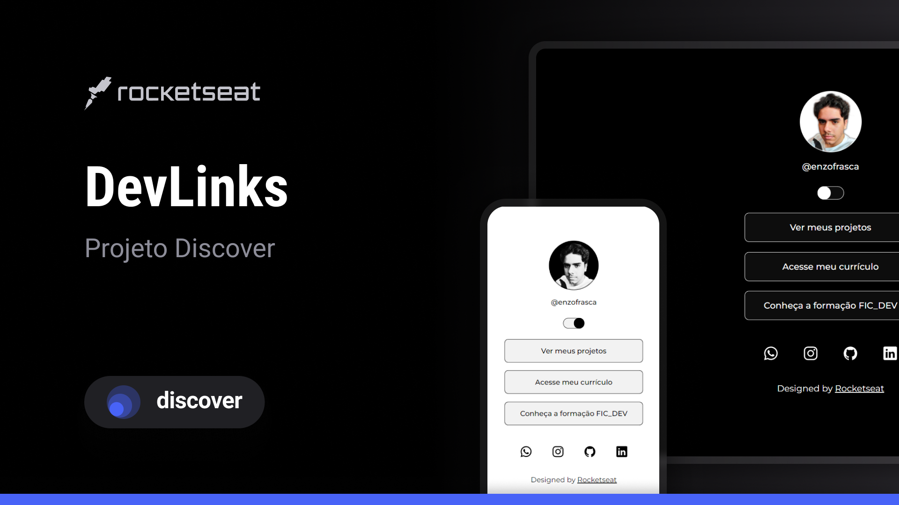

<<<<<<< HEAD
<h2>💻 Projeto </h2>

=======
<h1>💻 Projeto </h1>

>>>>>>> 335813b31e9d6e2cd6e6dbe936a75112f57b877d

O DevLinks é um agregador de links para usar como cartão de visitas online.

 

<h2>🚀 Tecnologias</h2>

Esse projeto foi desenvolvido com as seguintes tecnologias:

 

- HTML e CSS

- JavaScript

- Git e Github

- Figma

 

<h2>🔖 Layout</h2>

<<<<<<< HEAD
Você pode visualizar o layout do projeto através desse <a href="https://www.figma.com/community/file/1187422022288947321/DevLinks-%E2%80%A2-Projeto-Discover">Link</a>.
=======
Você pode visualizar o layout do projeto através desse <a href="https://www.figma.com/community/file/1187422022288947321/DevLinks-%E2%80%A2-Projeto-Discover">link</a>.
>>>>>>> 335813b31e9d6e2cd6e6dbe936a75112f57b877d

 

<h2>📝 Licença</h2>

Esse projeto está sob a licença MIT.

 

**@rocketseat**
